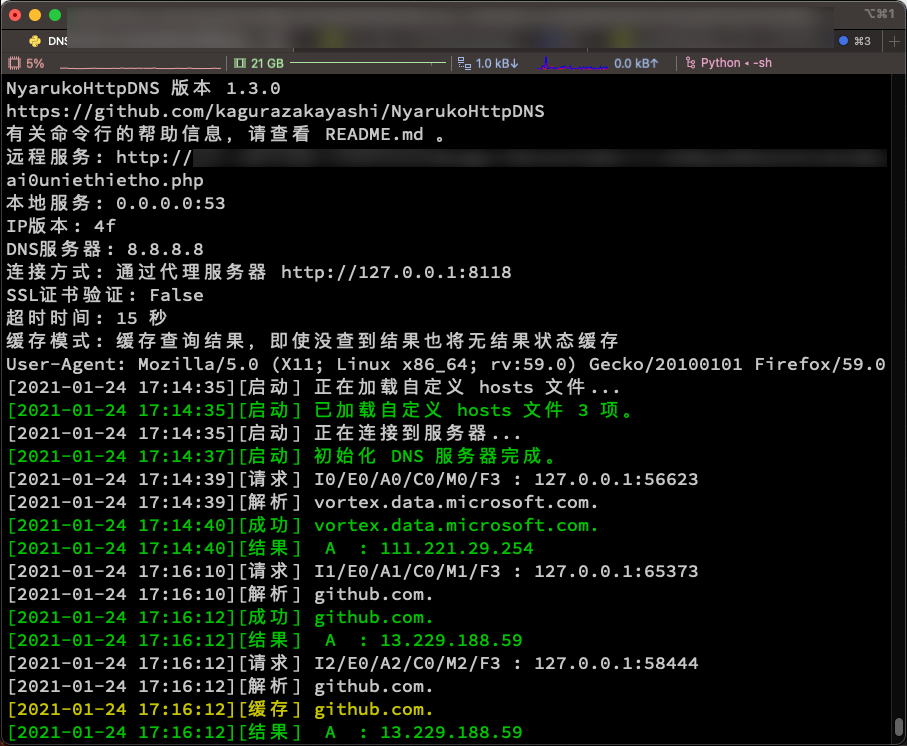

# NyarukoHttpDNS 1.4.0
- 将 DNS 解析结果使用 PHP 经过 `HTTP`/`HTTPS` 传输给本地客户端。
- 支持双端自定义解析、通过代理连接、查询结果缓存、证书检查、IPv4/v6版本配置。

- [PHP7服务端](#PHP7服务端) | [接收参数](#接收参数) | [返回结果](#返回结果)
- [Python3客户端](#Python3客户端) | [安装](#安装) | [参数](#参数) | [使用](#使用) | [命令举例](#命令举例) | [已知问题](#已知问题)
- [自定义hosts](#自定义hosts) | [服务端自定义hosts](#服务端自定义hosts) | [客户端自定义hosts](客户端自定义hosts) | [附](#附)
- 客户端工作截图：


# PHP7服务端
## 接收参数
可以接收以下 `GET` 或者 `POST` 参数：
- `h`: 要查询的主机名（也可以传 `linktest` 测试网络连通性）。
- `d`: 指定 DNS 服务器（可选，不提供则用主机当前 DNS 设置）。
- `i`: 需要查询的 IP 地址类型（可选）。可接受的选项：
  - `a`（默认值）, `4`, `4f`, `6`, `6f`
  - a 为所有，4 为仅 IPv4，6 为仅 IPv6，带 f 则为优先使用某项。
- `q`: 精简显示级别（可选）。可接受的选项：
  - `0`: 返回所有查询结果，包括 MX、TXT 等全部类型记录。此项将会忽略 `i` 的设置，`i` 会被强制指定为 `a`。
  - `1`: 返回所有 A/AAAA 记录及其详细信息。
  - `2`: 返回 TTL 最高的一条 A/AAAA 记录及其详细信息。此项将会忽略 `i` 的 `f` 参数。
  - `3`: 只返回 TTL 最高的一条 A/AAAA 记录的 记录类型 和 IP 地址。此项将会忽略 `i` 的 `f` 参数。
  - `4`: 只返回 TTL 最高的一条 A/AAAA 记录的 IP 地址。此项将会忽略 `i` 的 `f` 参数。
- `t`: 超时时间（秒）。超过指定时间则 PHP 脚本中止。

## 返回结果

- 成功：返回 JSON ，内容为数组，第一位为 `OK` 。
- 测试：返回 JSON ，内容为数组，第一位为 `TE` 。
- 失败：返回 JSON ，内容为数组，第一位为 `NG` 。
- 错误：返回 HTTP 403 状态码，检查提供的参数是否正确。

```
$ curl "http://127.0.0.1/NyarukoHttpDNS/index.php?h=php.net&d=8.8.8.8&i=6&q=3"
["OK",["AAAA","2a02:cb40:200::1ad"]]

$ curl "http://127.0.0.1/NyarukoHttpDNS/index.php" -X POST -d "h=php.net&d=8.8.8.8&i=4&q=4"
["OK","185.85.0.29"]

$ curl "http://127.0.0.1/NyarukoHttpDNS/?h=php.net&d=8.8.8.8&i=a&q=0"
["OK",[{"host":"php.net","class":"IN","ttl":377,"type":"A","ip":"185.85.0.29"},{"host":"php.net","class":"IN","ttl":377,"type":"NS","target":"dns3.easydns.org"},{"host":"php.net","class":"IN","ttl":377,"type":"NS","target":"dns1.easydns.com"},{"host":"php.net","class":"IN","ttl":377,"type":"NS","target":"dns2.easydns.net"},{"host":"php.net","class":"IN","ttl":377,"type":"NS","target":"dns4.easydns.info"},{"host":"php.net","class":"IN","ttl":377,"type":"SOA","mname":"ns1.php.net","rname":"admin.easydns.com","serial":1561190463,"refresh":16384,"retry":2048,"expire":1048576,"minimum-ttl":2560},{"host":"php.net","class":"IN","ttl":39,"type":"MX","pri":0,"target":"php-smtp3.php.net"},{"host":"php.net","class":"IN","ttl":377,"type":"TXT","txt":"v=spf1 ip4:72.52.91.12 ip6:2a02:cb41::8 ip4:140.211.15.143 ip4:208.43.231.12 ?all","entries":["v=spf1 ip4:72.52.91.12 ip6:2a02:cb41::8 ip4:140.211.15.143 ip4:208.43.231.12 ?all"]},{"host":"php.net","class":"IN","ttl":377,"type":"AAAA","ipv6":"2a02:cb40:200::1ad"}]]
```

# Python3客户端
## 安装
`pip3 install dnslib`
`pip3 install gevent`
`python3 -m pip install requests`

## 参数
`python3 ns.py -u <PHP网址> [-6] [-d <DNS地址>]`
- `-u <PHP网址>` 或 `--url <PHP网址>`
  - 输入上面PHP文件所部署到的网址
- `-b <IP地址:端口>` 或 `--bind <IP地址:端口>`
  - （可选）设置 DNS 服务器绑定的 IP地址 和 端口。默认值是 `0.0.0.0:53`。
- `-6` 或 `--ipv6`
  - （可选）优先返回 IPv6 地址，否则优先返回 IPv4 地址。
- `-d <DNS的IP地址>` 或 `--dns <DNS的IP地址>`
  - （可选）从指定 DNS 服务器进行查询，否则使用 PHP 主机的 DNS 设置。
- `-x <代理服务器地址>` 或 `--proxy <代理服务器地址>`
  - （可选）设置代理服务器，可以指定一个 http 代理服务器进行通信。
- `-p <端口>` 或 `--port <端口>`
  - （可选）设置 PHP 服务器的端口，默认自动根据 http 和 https 决定 80 或 443 。
- `-c <0/1/2>` 或 `--cache <0/1/2>`
  - （可选）在内存中缓存查询结果，已有结果不再查询服务器，直到程序退出。
    0. 禁止缓存
    1. 缓存查询结果，没查到结果则不缓存
    2. 缓存查询结果，即使没查到结果也将无结果状态缓存
- `-a <User-Agent>` 或 `--ua <User-Agent>`
  - （可选）设置 User-Agent 字符串。
- `-k` 或 `--no-check-certificate`
  - （可选）使用 https 通信时，不要检查证书（不推荐）。
- `-t` 或 `--timeout`
  - （可选）超时时间（整数秒），等待指定时间后仍未收到返回结果则中止。此选项的数值会同时发送给 PHP 端的此参数。
- `-m` 或 `--mono`
  - （可选）以单色模式输出。提供此项则按默认颜色输出，不输出彩色提示信息。如果需要将输出记录到日志则建议提供此参数。

## 使用
1. 使用上述参数启动。
2. 等待绿字提示「初始化 DNS 服务器完成」。
3. 使用 `nslookup php.net 127.0.0.1` 进行测试。
4. 若测试没问题，直接设置系统 DNS 即可。
  - 通常建议同时设置另一个公共 DNS 服务器，以防软件意外失效时导致系统立即失去解析。
5. 使用 Ctrl+C 即可退出。
6. 返回信息中的 `请求` 前面的数字说明（例如 `I1/E2/A3/C4/M5/F6` ）
  1. `I`: 成功返回结果次数
  2. `E`: 返回不可用结果次数
  3. `A`: 总计返回次数
  4. `C`: 缓存（包括自定义 hosts 文件）命中次数
  5. `M`: 缓存中存储的数量
  6. `F`: 自定义 hosts 文件中存储的数量

## 命令举例
客户端启动参数：

`python3 httpdns.py -u "http://www.xxx.xxx/n.php" -p 80 -x "http://127.0.0.1:1080" -t 15 -d 8.8.8.8 -k -c 2`

此条命令的含义：
- 访问的 PHP 网址是 `http://www.xxx.xxx/n.php`
- 访问的 PHP 服务器端口号是 `80`
- 要通过代理服务器 `http://127.0.0.1:1080` 访问这个 PHP 网址
- 要求 PHP 服务器必须在 `15` 秒内完成 DNS 查询
- 要求从 DNS 服务器 `8.8.8.8` 进行查询
- 无需检查 SSL 证书（`-k`）
- 将已经获取的结果缓存（`-c`）。下次再收到同样请求直接从缓存读取，即便是没有结果的结果，也无需再联网查询

`本机 Python 脚本` <…> `本机代理` <…> `远程代理服务器` <…> `远程 PHP 服务器` <…> `目标 DNS 服务器`

## 已知问题
- 在 macOS 下， PHP 网址是 https 协议、并启用代理服务器时，可能会出现无法连接到代理服务器的情况（`Caused by ProxyError('Cannot connect to proxy.', timeout('timed out')`）。

# 自定义hosts
您可以创建一个文件名为 `hosts.txt` 的文件，来自定义 IP - HOST 对应关系。
- 服务端和客户端均支持自定义 hosts，通常只需要设置客户端即可。
- 如果客户端要查询的 host 被记录在此文件中，则直接返回此文件所记录的 IP 地址，不进行任何查询。
- 建议定义一个与查询服务器对应的 IP 地址条目，以免自查。
- 如果不需要此功能，请不要放置同目录下的 `hosts.txt` 文件。
- 写法和标准 host 文件一致：
  - `ip地址` `主机名`

## 服务端自定义hosts
- 创建一个文件名为 `hosts.txt` 的文件和 `.php` 文件放置在一起。
- 如果写入过于庞大的数据、且访问量较大，会影响 I/O 性能。

## 客户端自定义hosts
- 创建一个文件名为 `hosts.txt` 的文件和 `.python` 文件放置在一起，可为本地DNS服务端自定义hosts。
- 如果没有统一更换的需要，建议使用客户端来进行自定义 hosts，可以获得最佳性能。

# 附
- 清除DNS缓存命令
  - Windows: `ipconfig /flushdns`
  - macOS: `sudo dscacheutil -flushcache`
  - Linux: `service nscd restart`